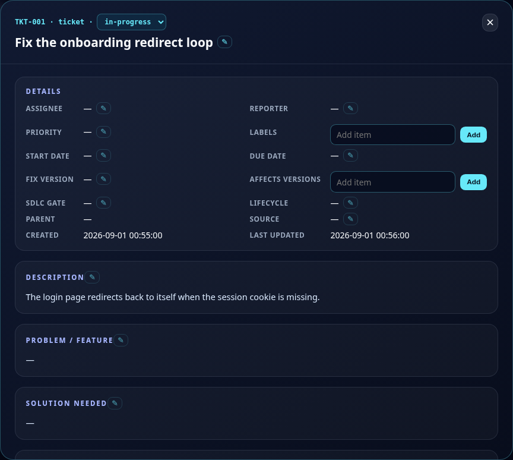
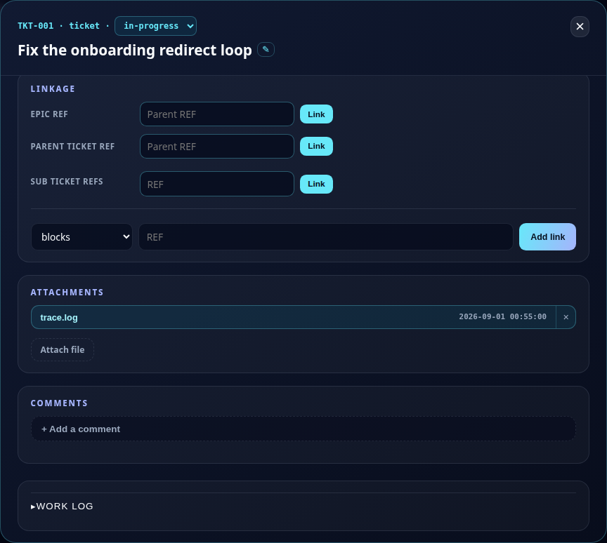

# Tira

Tira is a filesystem-native Kanban project manager for Developer Dashboard. It
provides Jira-style projects, SOWs, epics, and tickets over a transparent local
filesystem engine accessed exclusively through Tira commands.

Release 1.04 implements the complete command ecosystem: projects, independent
boards, columns, records, links, people, comments, attachments, evidence,
gates, search, dashboards, agent-efficient TOON output, singular record
ownership, planning metadata, immediate parents, and inactive-person controls.
Attachment retrieval streams content without exposing its managed location.
Text is strict UTF-8 end to end, including long comments and currency symbols;
legacy isolated-byte records are repaired when next updated.
Every SOW, epic, and ticket also has an ordered checklist of item/status pairs.
Repeatable content and scope options append safely on update; explicit
`--set-*` options are the only wholesale replacement route.
Attachment-add responses distinguish the supplied filename from the filename
actually retained when identical content is deduplicated.
Migration-scale tools provide one-call export, field-aware search, previewed
bulk import/replacement, and append-only gate/evidence corrections.
Hierarchy views retain the complete direct-read record at every node and add
children, so human and recursive JSON views cannot silently lose metadata.
Dashboard reads scan each selected board once and group records by configured
column in memory, keeping multi-column boards responsive without an index.
The default dashboard reads only filenames and modification times; `--title`
adds titles with one JSON read per card, while `-o json` returns full records.
Every mode orders cards newest-first by filesystem modification time.
`-o table` emits a self-contained, responsive dark Kanban document with
left-to-right columns, stacked type boards, embedded styling, card selection,
and local last-modified/reference sorting. It makes no network requests.
Project selection also accepts aliases registered with `d2 path`; Tira resolves
them through Developer Dashboard without printing the private target directory.
The live browser board opens every card in a Jira-style sectioned dialog with
in-place field editing and full comment management, including permanent
comment deletion through the `tira.comment.remove` command.
Attachments are first-class in the dialog: chips open images, PDFs, and text
inline in an overlay viewer with no download step (HTML is forced to plain
text so nothing executes), files upload from the dialog with a 16 MB cap,
deletion is reference-safe under content-hash dedup via the new
`tira.attachment.detach` command, and every comment shows and manages its
own attachments separately from the record strip.
Every list field is editable per item from the dialog — labels, affects
versions, key details, deliverables, scope, acceptance criteria, test steps,
BDD, and ATDD — and checklist entries can be added and edited in place while
remaining retained-not-deleted.
Linkage is editable from the dialog too: set or unlink hierarchy and
sub-item parents, link and unlink children, and add or remove typed links
with reciprocals through the same transactional engine commands as the CLI.
Long-text sections carry their edit pencil in the section heading, and the
whole dashboard is responsive down to phone width with a near-fullscreen
dialog and a stacked details grid. Card drag-and-drop runs on pointer
events, so it works identically with a mouse and with touch: hold a card
briefly on a phone, drag its floating ghost to the highlighted column, and
the same real JSON-file move applies.
Attachments render as a one-per-row list with right-aligned full timestamps, sorted
newest first — legacy references recover their real timestamp from the
stored file's own modification time; comments list
newest first under a collapsed top composer that expands into an author
picker, a bold/italic/code/list formatting bar, and markdown storage with
safe formatted rendering in the dialog. Text attachments render in the
viewer's own themed panel with deterministic contrast in every color
scheme, instead of the browser's default plain-text document.
A required action marked done on evidence another item in the same column
already used is highlighted rather than merely ticked, and its proof modal
opens with the reason for the reuse above the evidence itself — the point of
making somebody write a reason is that somebody else reads it.
A required action can say what it is running before it can prove it. Give
`--command` on its own and the item keeps its status while recording what is
being run, and the card dialog marks it with a clock — distinct from an
untouched item, from a done one, and from an exempt one. The proof follows when
the command has produced something, repeating its command; `--status done` is
what marks the item done and still refuses without the pair. Before 4.64 that
same call was accepted and silently discarded, so a list of pending items could
not say which one was being worked on right now. An announcement that is never
proved stays visible, which is the point.

The card dialog says which required-action group is yours. It renders one group
per column, and on a card with a history that is a column of headings, exactly
one of which is the work actually owed. Since 4.75 the group for the card's own
column carries an accent border and reads `<column> - N owed here`, where `N` is
what is unmet in that column rather than the card-wide `Required actions (18/75)`
count the section heading shows. Both numbers are on screen because they answer
different questions. `N` is the same number `tira.required-action.list
--blocking` prints: the browser and the CLI read one selection, so they cannot
drift.

A required action's status is read the way every gate reads it. `done`, `Done`
and `DONE` all mean finished, in the count, in the tick, and in whether a
checkbox is offered — and since 4.68 there is one predicate that says so, asked
by every reader in the command layer, rather than four hand-written comparisons
that had already drifted apart once. Until 4.63 the page compared against the literal `done`
while the engine had been case-insensitive since TKT-434, so an item marked
`Done` was finished to the gate and an empty box to whoever was looking — and
the box was not merely wrong, it offered to redo work already done. Nothing is
normalised on disk: `Done` stays `Done` and is simply read correctly.
A card's checklist is read the same way, and until 4.66 the push gate was not:
it compared each item's status against the literal `done` and refused the
release of 4.57, 4.58 and 4.59 over items that were every one of them marked
done, as `Done`. The gate now reads the engine's own `checklist_done` to decide
whether anything is outstanding at all; it still works out *which* items to
name for the message itself, and does that case-insensitively, matching the
engine. So the decision has one implementation and the naming has a second one
that a test holds to agreeing - which is what the card asked for, in its own
words: "either they share one implementation, or a test asserts they agree". The same file compared statuses in two places and they
failed in opposite directions — one refused a good push, and the other, which
catches a finished checklist under an unfinished column, never fired against
`Done` at all.
An attachment previews if the board can read it as text, and the twelve
languages listed on TKT-645 are syntax highlighted by a 4.5KB tokeniser
embedded in the page — the board loads nothing from another host, so a CDN
highlighter was never an option. A genuinely binary file still refuses rather
than rendering as mojibake, and an unknown extension is decided by reading its
first bytes rather than by its name.
The board-wide police policy engine — the 41 rules police itself watches,
separate from a column's own required-action template — is editable from
the browser too: a Policies button opens a modal listing every declared,
declined, and undeclared rule, with a rule-specific parameter picker that
matches the `tira.policy.add` command exactly.
A refused move tells you what to do about it. The refusal names each
blocking required action with the id you need to mark it done and ends with
a command carrying a real one, rather than a placeholder you have to look
up. `tira.required-action.list --blocking` asks the same question without
attempting the move, scoped to the column the card is in — the command
without that flag returns every item on the card across every column.
A column can require work on the way IN as well as on the way out. Its
`--required-action` list says what a card must finish before it may leave;
`--entry-required-action` says what it must already have done before it may
arrive, for work that belongs to neither column — "verify all details in the
card", between backlog and tests-red, is not backlog's business and cannot be
tests-red's exit action because the card is not in yet. A move made through the
CLI is refused while any entry item is unmarked and the card stays exactly where
it was, with the items placed on it first so they can be worked from outside.
Dragging a card in the browser is not refused — a human on the dashboard is not
an agent skipping a gate — but the dragged card still arrives carrying what that
column asks of it. Entry actions are declared from the CLI and from the browser
column editor, and marking one done costs the same `--command`/`--proof` pair as
any other required action.
Since 4.71 that editor shows the two lists in the order a card meets them — the
entry list above the exit one — and each names itself rather than leaving the
unqualified one to be identified by elimination: **Entry required actions** and
**Exit required actions**, with each add field inviting the list it belongs to.
Before that the entry list rendered below the exit one, the exit list was
labelled simply "Required actions", both add fields read "Add a required
action", and the entry inputs sat at half width beside a row that filled.
A card created straight into such a column **through the CLI** gets those
entry items too, since 4.67, and is never refused for them. The browser's own
create flow is untouched and still seeds neither list - it calls the engine
directly rather than going through the command, which is a separate gap and its
own card. Until then creation seeded only the exit
list, so a card born in a gated column was born past the gate — no items
recorded, nothing checking it, the gate skipped rather than failed. It cannot
be blocked instead: a required action's proof is a command and its output, and
before the card exists there is nothing to run a command against. So the items
are recorded pending and the create prints what the card owes on standard
error, naming the two kinds by what each is for — owed now, against owed before
it leaves the column. That message covers the exit items as well, which had
been seeded on create since 3.x and printed by nothing, so an agent met them
only at a refused move.
A column's required actions hold whether or not the caller says which board
the card is on. Listing a board's columns needs a type; moving and showing a
card do not, because a ref identifies it on its own. Until 4.54 a move that
omitted `--type` therefore succeeded with the gate silently skipped — a card
walked through nine gated columns with 75 required actions outstanding — so
the type is now recovered from the card itself. A typeless move whose required
actions are done still goes through: the point is knowing which columns exist,
not making the caller repeat what the board already knows. Where a refusal
ends by naming the move to make instead, it uses the recovered type, so the
command it prints is one that runs.
`--help` names the arguments a command refuses without, including the
`--command`/`--proof` pair that marking a required action or a checklist item
done costs. Forty-nine commands are not there yet and still answer with a bare
`[options]` — `tira.police`, `tira.next` and the `policy.*`, `backup.*` and
`project.*` families among them; that set is a written-down ledger a test
holds, so it can shrink but not grow unnoticed.
The Columns dialog also carries an Entry checkbox per row, so which
column (or columns — a board can start new cards in more than one
place) new cards land in is chosen from the browser, not just
`tira.column.roles --role entry=X`.

## Value

Tira gives people and AI agents a shared project-management model without a
server or opaque database. Folders represent Kanban columns, JSON files
represent work records, and YAML files hold project and board configuration.

### Why mirror Jira locally?

Tira keeps Jira's familiar project, epic, ticket, and Kanban concepts while
removing payload overhead that quickly consumes an LLM agent's context and
usage allowance. In measured migration examples, Jira responses averaged
about 3.3 times the size of equivalent Tira records, with the gap increasing
on comment-heavy work:

- Jira ADF expands each paragraph into a nested `type`/`content` tree.
- Every Jira comment repeats its author's account, timezone, and avatar block,
  including five image URLs.
- Jira needs separate issue and comment requests; one Tira `show` includes the
  record and its comments.

For example, Ticket at Jira occupied 1.04 MB across two requests and 301 KB in one
Tira read. If ticket was only 1.29 times larger in Jira because it had no comments,
supporting the conclusion that repeated author metadata drives much of the
growth. A heavy ticket can therefore use roughly one-third of an agent's
context with Tira, in one operation instead of two.

Tira deliberately has no HTTP transaction layer. Commands operate directly on
validated local files and column folders, keeping the system simple,
inspectable, and efficient.


*Terminal output from `tira.police` and `tira.ticket.show`.*

## Requirements

Tira is a Developer Dashboard (DD) skill and does not run without DD
installed first. DD is the shared CLI/collector framework this and every
other skill on this machine plugs into - it resolves project locations,
dispatches `dashboard`/`d2` commands to the right skill, and runs background
collectors. See [Introducing Developer
Dashboard](https://michael.vu/post/2026-04-24-introducing-developer-dashboard.html)
for what it is and why it exists.

## Installation

```bash
dashboard skills install tira
```

## Commands

Create a project:

```bash
d2 tira.project.create --name "Delivery" --dir ./delivery
```

Create free-ranging records and link them later:

```bash
d2 tira.sow.create --title "Ship v1"
d2 tira.epic.create --title "Authentication"
d2 tira.ticket.create --title "Implement login"
```

Operate the board, relationships, and collaboration data:

```bash
d2 tira.column.add --type ticket --name in-progress --after backlog
d2 tira.hierarchy.link --parent SOW-001 --child EPC-001
d2 tira.link.add --from TKT-001 --type blocks --to TKT-002
d2 tira.comment.add --ref TKT-001 --author ada --text "Ready for review"
d2 tira.checklist.add --ref TKT-001 --item "Run regression" --status "To Do"
d2 tira.checklist.update --ref TKT-001 --id CHK-001 --status Done
d2 tira.attachment.add --ref TKT-001 --file ./evidence.png -o json
d2 tira.project.people.deactivate --id ada
d2 tira.dashboard --type all
d2 tira.dashboard --type all --title -o human
d2 tira.dashboard -o table > kanban.html
d2 tira.dashboard.ticket --title -o table > tickets.html
d2 tira.dashboard -o browser
d2 tira.dashboard.ticket --title -o browser=localhost:4567
d2 tira.tasklist.add --text "read the README"
d2 tira.job.add --schedule "0 * * * *" --message "go hunt some bugs"
d2 tira.job.list
d2 tira.tasklist.list
```


*The ticket board rendered by `-o browser`: columns and cards.*


*The card-detail modal: description, priority, and other fields.*


*The same modal scrolled down: linkage and attachments.*

`-o browser` also renders a Task List section below the ticket board: every
item from `tira.tasklist.*` as a colored sticky-note card (pending=amber,
working=purple-blue, done=green), with list-level controls (add, session,
next/shift/pop/unshift/slice/prune) and per-card controls (status, remove,
attach, ref) - full parity with the CLI commands below.

Below that sits a Repeated Jobs section, one row per scheduled job the board
carries: its id, whether it is enabled, its schedule, what it says or runs,
and its mode and schedule kind. It is read-only and refreshes every thirty
seconds, so what a board is scheduled to do is visible on the board rather
than only in its stored job records.

`dashboard tira.onboard` asks for everything a new project needs and creates
it from the answers. `dashboard tira.onboard -o browser` does the same thing
over one HTML form instead of a terminal prompt: a disposable, no-login
server on `127.0.0.1` (a free port picked automatically, or
`-o browser=127.0.0.1:PORT` for a specific one) that creates the project on
submission and stops itself right after. Pointed at a directory that
already has a project, the form pre-fills its current name/members/
columns/prefixes the same way the terminal wizard does, and offers every
field the wizard's guided flow does - stuck-card minutes, agent/session/
collector, and the project-mode question. Naming an agent is worth doing
rather than skipping: it is what lets police tell a stopped agent from one
correctly waiting, since `agent-still` stops counting a working-column
card against the agent once it is assigned to somebody else. The same thing non-interactively, for scripts: `dashboard tira.project.new
--name "MT5" --members "K-Bot, Michael" --columns "Backlog, Planning, In
Progress, Done / Release" --sow-prefix M5S --epic-prefix M5E --ticket-prefix
M5T` creates the project, its people, each board's reference prefix, and the
same columns on all three boards, with column names written as they read.

Tira uses `Cpanel::JSON::XS` when it is installed and core `JSON::PP`
otherwise. The accelerator is optional and needs no configuration; on a
138-record board it takes a titled dashboard from about two seconds to
twelve milliseconds. Both backends emit identical bytes, so installing or
removing it never rewrites a record or changes a content hash.

HTML dashboards reload every sixty seconds and display the active interval.
Each board header offers a column-width choice: Standard keeps fixed-width
scrollable columns, Fit all shrinks every column to fit the container so no
sideways scrolling is needed. The choice is remembered in browser storage;
narrow screens keep scrollable columns regardless.
Append `?refresh=30` to the browser URL to select a positive interval in
seconds; zero is safely clamped to one second. Browser output serves the same
board shell through Dancer2, defaults to `0.0.0.0:7899`, and accepts `0.0.0.0`,
`127.0.0.1`, or `localhost` with an optional port. Each request rescans the
filesystem.
Since 4.70 the page comes from a View rather than from Perl string
concatenation: the markup lives in Template Toolkit templates under
`lib/Tira/views`, beside the stylesheet and the scripts, and the module keeps
none of it. Since 4.74 the CLI is split the same way for the same
reason: `lib/Tira/CLI.pm` was 6,048 lines with every command body in it, and is
2,939 now, with the bodies in `lib/Tira/CLI/` - `Browser`, `Police`, `Serve`,
`Records`, `Board`, `Wizard`, `Usage`, `Backup`. Each is loaded only when one of
its commands runs, so an ordinary card command compiles none of them.
Since 5.23 the engine is being split the same way and for the same reason:
`lib/Tira.pm` was 15,264 lines, and the concerns that can stand alone are
moving out one per release - `lib/Tira/Toon.pm` (the TOON encoder/decoder
overrides, 5.23), `lib/Tira/Tasklist.pm` (the shared to-do queue, 5.24) and
`lib/Tira/Render.pm` (the human and table renderers, 5.25), each loaded with
`require` at the point it is actually needed. `lib/Tira.pm` is 14,177 lines
so far. Entry points keep their names throughout - the split is where the
code lives, not what anything is called. They are inlined at render rather than linked, so the board still
loads nothing from another host — every request the live page makes is to
itself (it polls its own card data, fetches a record when you open a card, and
posts a move when you drag one), and a table-mode board saved to a file makes
none at all. That is the property that ruled a CDN highlighter out on TKT-645
and it is unchanged here. The templates resolve from the module's
own location, so an installed skill finds them wherever it is run from. The page polls lightweight card placement data and moves cards in
place without reloading. Dragging a card calls the real record-move operation,
which moves its JSON file into the target column folder. Click a card to load
its complete record on demand in a Jira-style dialog that renders section by
section — a details grid, description and solution texts, planning lists,
checklist, linkage, evidence, attachments, and threaded comments — never as a
raw JSON dump. Single-value fields are editable in place through the same
validated engine as the CLI, and the comment section adds, edits, and
permanently deletes comments with an author picker limited to active project
people. Validation failures appear inside the dialog. “Last updated” changes
only after fresh data is applied. Stop the foreground command with
Ctrl-C when the dashboard is no longer needed.

The default all-interface bind is reachable from permitted network peers. Use
`localhost` or `127.0.0.1` when the complete ticket payload must remain local
to one machine.

Read or correct many records without spawning one process per ticket:

```bash
d2 tira.export -o json
d2 tira.ticket.list --full -o json
d2 tira.search --text Jira --field description -o json
d2 tira.import --file changes.json --dry-run -o json
d2 tira.replace --pattern Jira --with Local --field description --dry-run -o json
d2 tira.gate.annotate --ref TKT-001 --id GATE-001 \
  --note "Use local documentation" --author ada
```

Repeat `--field` to review or change several fields while preserving historical
comments:

```bash
d2 tira.search --text 'dashboard doc.' \
  --field description --field bdd --field atdd -o json
d2 tira.replace --pattern 'dashboard doc\.' --with 'the docs vault' \
  --field description --field bdd --field atdd --dry-run -o json
```

Search always returns `{hits, count}`. Unnamed fields are not inspected by a
scoped replacement.

Remove `--dry-run` only after reviewing the returned field-level changes.
Import applies the complete ref-keyed change set transactionally. Gate and
evidence corrections append annotations; their original observations remain
unchanged.

`tira.import` and `tira.replace` are the only commands that honour `--dry-run`.
Every other command refuses it by name instead of accepting it and writing
anyway - `tira.ticket.create --dry-run` used to create the card. TKT-625.

SOWs, epics, and tickets share planning metadata. For example:

```bash
d2 tira.ticket.create --title "Security review" --assignee ada \
  --reporter grace --label Security --priority 5 \
  --start-date 2026-08-06T09:00:00Z \
  --due-date 2026-08-08T17:00:00+01:00 --fix-version 3.0.0
```

Assignee and reporter values are person IDs in JSON and names in human output.
Inactive people remain visible on historical work but cannot receive new
ownership.

## Output

TOON is the default and is also selected explicitly with `-o toon`.
`-o json` returns canonical pretty JSON. `-o human` returns Markdown:

```bash
d2 tira.ticket.create --title "Add tests" -o json
d2 tira.epic.create --title "Release gate" -o human
```

Print the complete agent manual as raw Markdown:

```bash
d2 tira.skills
```

The manual is the complete technical contract. It records every command
signature, argument interaction, output and exit contract, transaction
invariant, and 100 implemented use cases while intentionally keeping managed
project location opaque.

## Managed-storage model

Tira owns a local filesystem-backed database, but its location is intentionally
not part of the agent interface. Backlog and Discard are always present and
protected. Use the CLI for every read and mutation; manual managed-file editing
is unsupported.

Commands find the board by walking up from where they start looking - the
current directory unless a project is named explicitly - so they work anywhere
inside a project without being told where it is. When nothing is found on the
way up, the command refuses and names the directory it searched from -
`No Tira project found from '/some/where'` - which is usually the fastest way
to notice you are not where you thought you were.

See [the foundation guide](docs/foundation.md) and [SKILLS.md](SKILLS.md) for
the complete implemented Tira ecosystem.

## Verification

Run tests only through the workspace Docker environment:

```bash
docker compose -f ~/projects/skills/docker-compose.testing.yml run --rm perl-test \
  bash -lc 'cd /workspace/skills/tira && cpanm --quiet --notest --installdeps . && prove -lr t'
```

The release gate requires 100% statement and subroutine coverage plus the
post-coverage `perlsec` and taint-mode audit recorded in `tickets/TESTING.md`.
Since 4.73 that means every module under `lib/`, found by looking rather than
by a list somebody typed — `tools/gate-run` enumerates them, names the ones it
checked, and refuses a release for any that is missing from the coverage report
or below 100%. A module can be exempted, but only by being written into the
gate's exemption list with a reason beside it; the list is currently empty.
Until then the gate named three module paths by hand and
`lib/Tira/OnboardWeb.pm` was in neither of the two places it needed to be, so
it had no coverage requirement at all and nothing said so.

The suite also holds two of the counts these documents assert to the code that
answers them: how many use cases the catalogue lists, checked against the `UC-`
entries themselves, and how many rules police the board, checked against
`policy_rules()`. Since 4.76 the second is checked by shape rather than by
sentence — every markdown file in the repository bar the build and dependency
directories (`cover_db`, `node_modules`, `.git`), and any claim that puts a
number ahead of the word `rules` with at most two words between them. That
covers `41 rules cover`, `41 rules police`, `41 police
rules` and `41 policy rules`, and it is the whole of its reach, worth stating
plainly because a guard described more broadly than it works is the failure it
exists to prevent: a claim worded outside that shape is not held, and neither is
one made anywhere but a markdown file. The same count stated in a source comment is TKT-736, still open.

The rule count is the case that taught this: it was stated in three places and
checked in one, because the guard
matched a single phrasing of it, so every rule added dutifully updated the
sentence beside the test and left the differently-worded one two thousand lines
earlier four releases behind. The guard's existence is what hid it. A
number nobody checks is obviously unreliable and gets re-read; a number that is
checked reads as reliable. `t/433` now walks the documents rather than a list of
filenames, and matches the shape rather than the sentence, so a wording nobody
has thought of yet is held,
and the narrow check that preceded it was removed rather than widened — two
checks of one fact is the shape that produced the drift.

A number inside a fenced or indented example is left alone. Those are
transcripts of what was true when they were taken, and a guard that demanded
history be rewritten on every rule added would be edited out rather than obeyed.
That exemption is why the same guard also requires every document's fences to
close: `SKILLS.md` had carried an opener glued to the end of a prose sentence
since 2026-08-11, where it opens nothing, and the `` ``` `` meant to close that
block opened one instead — inverting every fence in the thirteen hundred lines
that followed and hiding one of the three claims inside an example block nobody
wrote. A reader that quietly checks less than it appears to has to say so.

**A coverage refusal names the lines, not just the percentage.** Since 4.77 the
gate prints the uncovered statements and subroutines beneath the module it
refused on:

```
gate-run: coverage is below 100% for lib/Tira.pm - no record written: lib/Tira.pm 99.8 100.0 99.8
  lib/Tira.pm:12134
  lib/Tira.pm:8826 sub _task_changed_mark_seen
```

The percentage stays, because it is what proves the threshold was applied. To ask
the same question yourself, against a `cover_db` you already have:

```bash
./tools/coverage-holes --db cover_db                    # everything it found
./tools/coverage-holes --db cover_db --module lib/Tira.pm
./tools/coverage-holes --db cover_db --all              # past the 20-line cap
```

It reads the `Devel::Cover` database rather than parsing `cover -report text`,
which is a report for people whose column layout is not a contract — parsing it
failed five times in one session, and finding `lib/Tira.pm:12134` by hand cost
another. It prints nothing when everything is covered, so a passing gate is not
made noisier, and exits 2 when the database is missing or unreadable rather than
printing nothing and reading as a clean tree. Above twenty holes it caps and says
how many it held back: a partial run of one test file against this tree produces
5,625 uncovered lines in `lib/Tira.pm` alone, and a refusal that prints those has
replaced one unusable output with another. TKT-593.

**Coverage under `prove -j N` was once unsafe here; retested and no longer
reproduces.** Measured on 4.76, `-j 4` under `Devel::Cover` reported
`lib/Tira.pm` at 99.8% statement with one uncovered `map` body that three
separate tests demonstrably enter, while the same tree run with plain
`prove -lr t` reported 100.0%. That measurement stood as the reason
`tools/gate-run` ran the suite serially for several releases. TKT-683
re-tested it properly - after two earlier attempts had been reverted for
the wrong reason (both blamed `-j`/`Devel::Cover` for failures that turned
out to be an unrelated fixture bug, corrected without ever isolating a
clean serial baseline first) - and could not reproduce the data loss:
three separate runs (`-j 7` twice, `-j 4` once, the same worker count the
4.76 measurement used) each reported 100.0/100.0/100.0 on both
`lib/Tira.pm` and `lib/Tira/CLI.pm`, with wallclock roughly half the
serial baseline (509-555s versus 1238-1449s). `tools/gate-run` now runs
`-j`, deriving the worker count from the machine and leaving one core
free. The original incident is kept here rather than deleted: it was a
real, measured failure once, on this same suite, and a future report of
coverage loss under `-j` deserves to find this history rather than
assume it has never happened.

Bumping the release version means `.env`'s `VERSION=` line and
`lib/Tira.pm`'s `our $VERSION` always agreeing - `tools/bump-version NEW`
writes both together and refuses rather than guessing if they already
disagree. `Changes` (the dated entry with real release notes) and
`t/03-metadata.t`'s own two version literals stay hand-written on purpose.

Since 4.62 the push hook does not run the suite. The `verify` column does,
once, and records the result on the card as evidence - which is what puts
the card in the `push` column in the first place. The hook still refuses a
push eleven ways (the version against what is shipping, the board backup,
incomplete cards, the documentation, every documented example, the browser),
but it starts no container and takes seconds rather than the twenty minutes
it used to.

`tools/gate-run` is still here and is now the only place the suite is run
against a *commit* rather than against your working directory: it checks out
HEAD into a throwaway worktree and runs the suite and coverage there, so a
change that passes only because of an unstaged file fails there instead of
failing for everybody else. It requires a clean tree and refuses rather than
guessing, because it records its result against HEAD's tree and an uncommitted
change is not part of that. Run it after committing and before `git push`.

It still records a pass keyed to that commit's tree; `tools/gate-cache-read`
is how you ask whether the tree `HEAD` currently points at was already proved
(it takes no argument and answers for that tree alone). Nothing reads those
records automatically any more - the hook stopped consulting them along with
the suite they existed to skip - so the record is for you, not for the gate.

When a gate asks for a code review, run it through `tools/review-worktree`
rather than pointing the reviewer at the checkout:

```bash
./tools/review-worktree codex exec --skip-git-repo-check \
  -c sandbox_mode='"danger-full-access"' "<the review prompt>"
```

It runs the command in a throwaway clone of this repository with your
uncommitted work carried into it - tracked changes, staged state and untracked
files - so the reviewer reads and runs everything, and an ordinary relative
write or git command reaches the throwaway rather than your checkout. It is not
a sandbox: a command that names an absolute path can still write wherever it has
permission. What it removes is the checkout from the reviewer's working
directory, and the shared git directory a linked worktree would have given it.
Pointing a reviewer at the checkout directly once reverted two files of
uncommitted documentation with a `git checkout --`, and the loss was silent:
afterwards `git status` showed the files unmodified. TKT-626.

## License

Tira is released under the MIT License. See [LICENSE](LICENSE).
